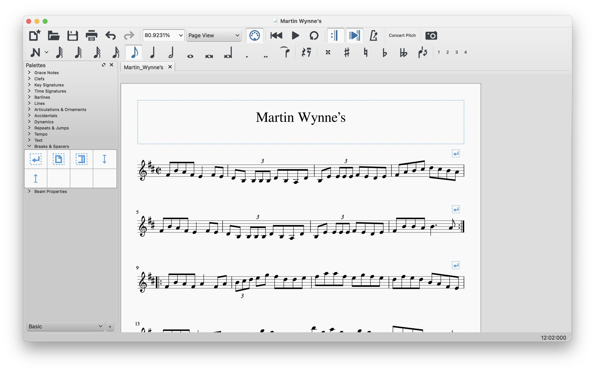
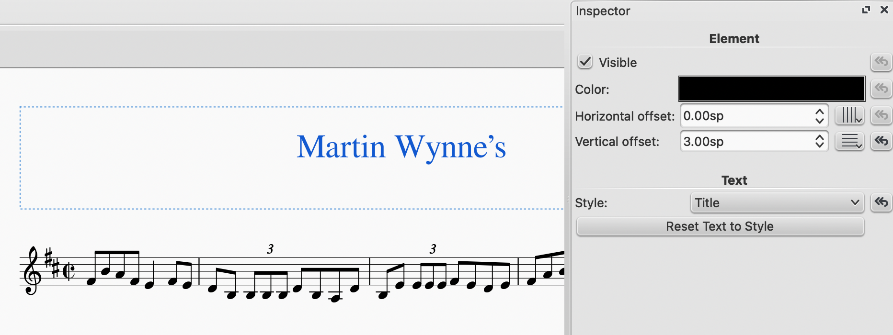
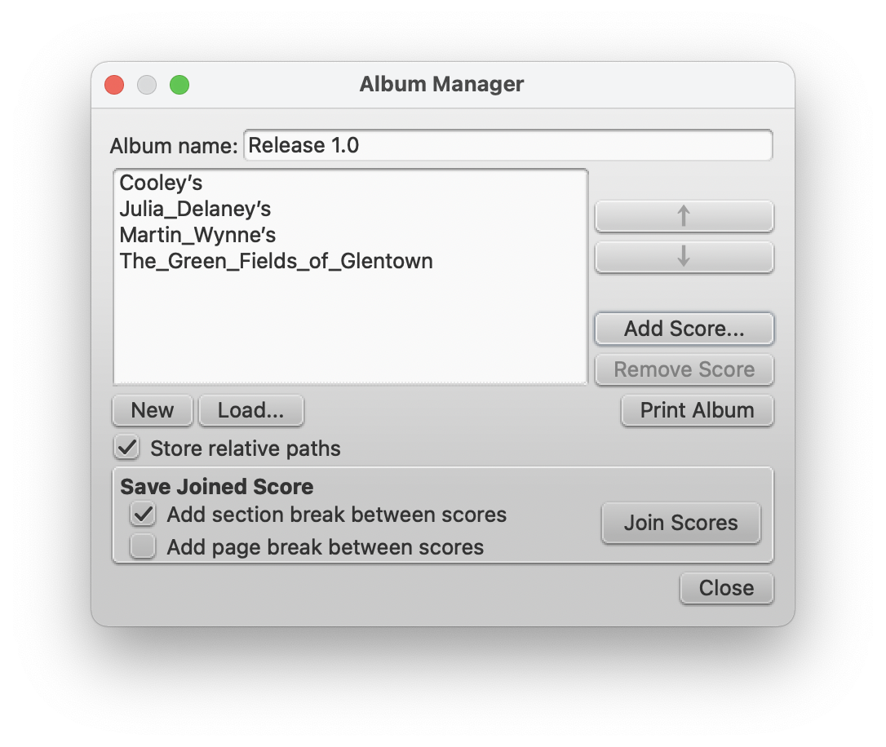
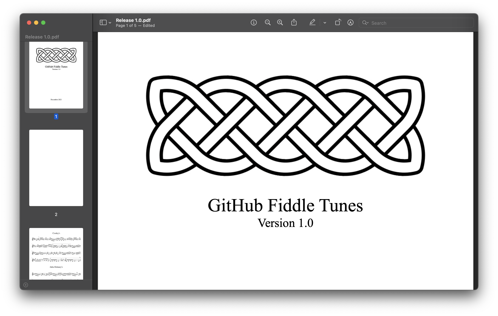

# fiddle-tunes
An archive of 50 traditional Irish fiddle tunes, in MusicXML format. Visit the [Releases](https://github.com/lorddev/fiddle-tunes/releases) page for downloadable PDFs.

> :warning: **Note:** MuseScore sometimes outputs transparent PNGs when exporting. For best experience when browsing the repository on GitHub, set your view settings to light mode.

## How to contribute
Use a notation app like [MuseScore 3](https://musescore.org) or similar.



Transcribe your tunes, and Export them to the appropriate folder as uncompressed `.musicxml` along with a `.png` file, and create a `README.md` with the PNG embedded in it.

Folder structure is like this:

```
- jigs
  - Tune_Name
    - Tune_Name.musicxml
    - Tune_Name-1.png
    - README.md
- reels
```

Then issue a pull request to get your updates merged.

## How to publish

Open all the files you want to publish and save them as `.mscz` files locally. Make sure the vertical spacing for the Title is set to 3.00.



Then use the Album feature in MuseScore 2 (not available in MuseScore 3) to merge the scores.



Combine the scores. Set the inner margins to 14.00mm, and check for windows and orphans. Then export a PDF file.

Open the PDF file in Preview on MacOS or another suitable PDF editor.

Insert the title page, and a table of contents before the first tune. (Because of the built-in pagination footers, the PDF is best printed in double-sided mode, if your printer supports that.)



Then [create a release](https://github.com/lorddev/fiddle-tunes/releases/new) and upload your compiled PDF. Be sure to add a tag in Git corresponding to the version number when creating a release.

_Sláinte_
