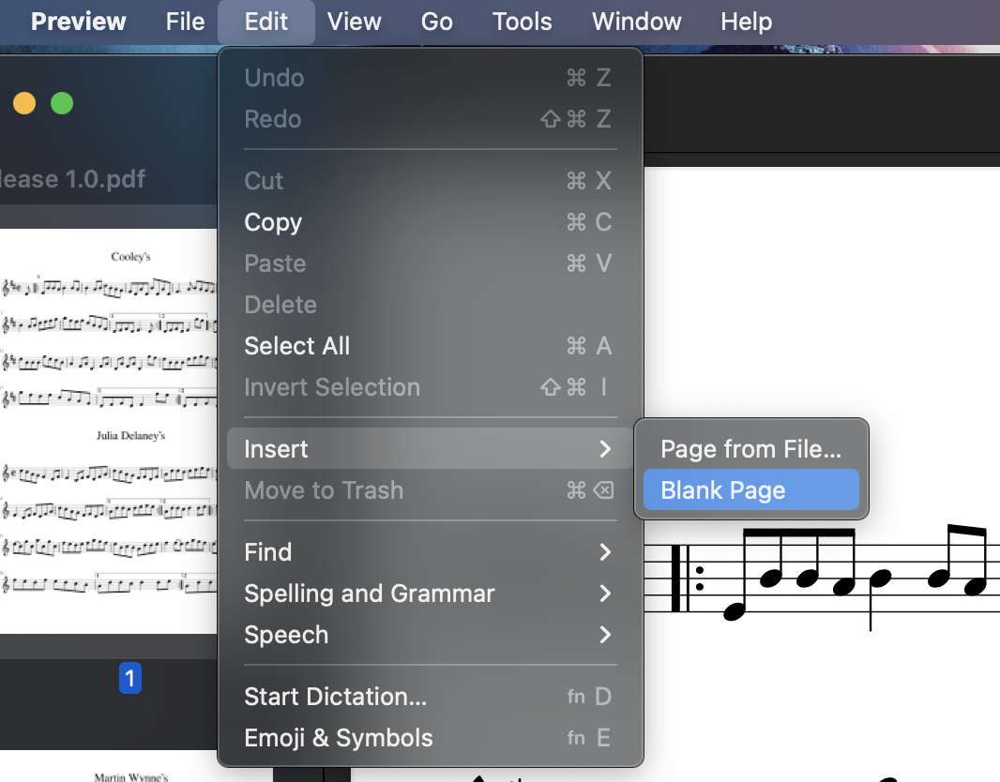

# fiddle-tunes
An archive of traditional Irish and Scottish tunes, in MusicXML format.

## How to contribute
Use a notation app like [MuseScore 3](https://musescore.org) or similar.


Transcribe your tunes, and Export them to the appropriate folder as uncompressed `.musicxml` along with a `.png` file, and create a `README.md` with a note about the tune and a link to the PNG.

Folder structure is like this:

```
- jigs
  - Tune_Name
    - Tune_Name.musicxml
    - Tune_Name-1.png
    - README.md
- reels
```

Then issue a pull request to get your updates merged.

## How to publish

Make sure the vertical spacing for the Title is set to 3.00.


Open all the files you want to publish and save them as `.mscz` files locally. Then use the Album feature in MuseScore 2 (not available in MuseScore 3) to merge the scores.


Combine the scores, then export a PDF file.

Open the PDF file in Finder on MacOS or another suitable PDF editor.

Insert the title page, and a blank page before the first tune.




Then [create a release](https://github.com/lorddev/fiddle-tunes/releases/new) and upload your compiled PDF. Be sure to add a tag in Git corresponding to the latest commit when creating a release.



**Note:** MuseScore sometimes outputs transparent PNGs when exporting. For best experience when browsing the repository on GitHub, set your view settings to light mode.



_Sláinte_
